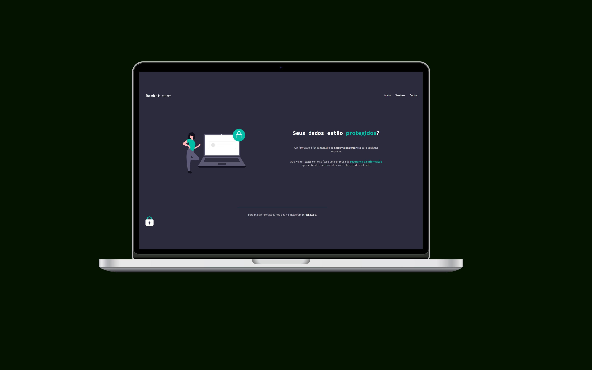

<h1 align="center">Desafio avançado - Recriando layout</h1>

  

  

## 💻 Projeto

Nesse desafio, eu tive que recriar uma aplicação, a partir de um layout, para treinar o que aprendi até agora no Stage 02.

- [Acesse o projeto]()

## 🚀 Tecnologias

Esse projeto foi desenvolvido com as seguintes tecnologias:

- HTML e CSS
- Git e Github
- Figma